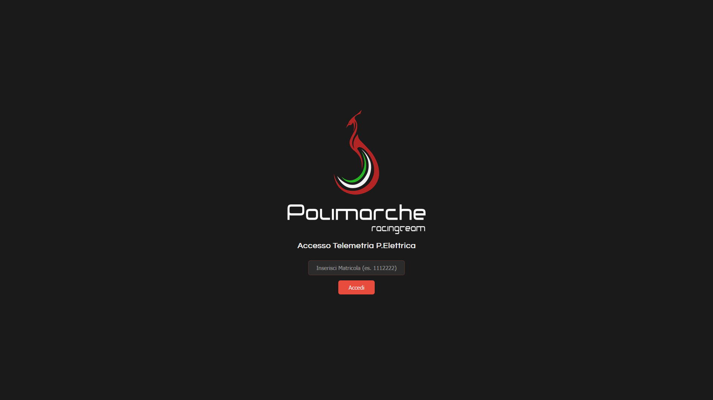
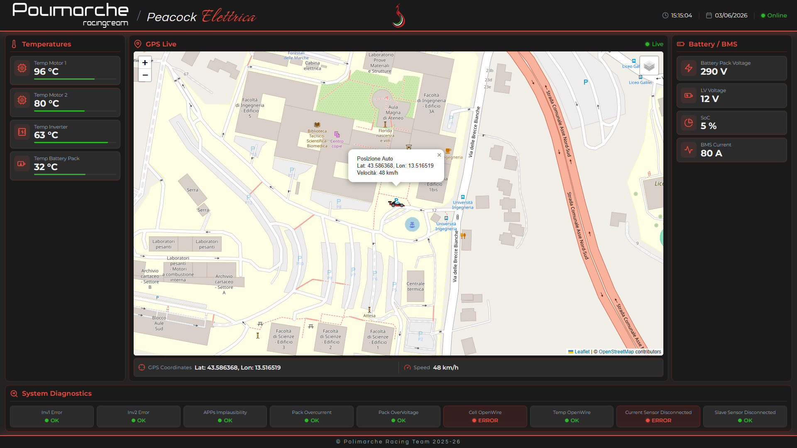

# 🏎️ Peacock Elettrica - FSAE Cloud Telemetry System

     
 

> 🌐 **Language / Lingua:** 🇬🇧 **English** | 🇮🇹 [Italiano](README_IT.md)
> 
> 📖 For detailed setup guides, architecture diagrams, and API reference, see the **[Project Wiki](../../wiki)**.
 
---

Serverless cloud infrastructure and web dashboard for real-time telemetry acquisition, processing, and visualization of the **Peacock Elettrica** Formula Student electric race car, developed by **[Polimarche Racing Team](https://www.polimarcheracingteam.com/it/)**.

Developed as part of the **Architetture dei Calcolatori e Cloud Computing (ACCC)** course - **Università Politecnica delle Marche (UNIVPM)**, A.A. 2025–26.

> ⚠️ This is a university project. Certificates, AWS endpoints, and access keys are **not** included in the repository.

---

## 📌 Overview

The system manages the complete data flow from the trackside receiver to the engineers' browser, ensuring ultra-low latency, high scalability, and cryptographically secure access - without exposing any credentials on the frontend.

The architecture decouples physical data acquisition from its global distribution, leveraging the AWS serverless paradigm:

1. **Edge Acquisition:** The car transmits data via LoRa module. A trackside receiver (UART/SPI) collects raw packets.
2. **Python Bridge:** A local Python script acts as a bridge - it decodes serial payloads and publishes them to **AWS IoT Core** over a TLS-encrypted MQTT connection (port 8883), using X.509 device certificates for authentication.
3. **Cloud Distribution:** AWS IoT Core acts as the MQTT broker, receiving all telemetry messages on the `P5/telemetry` topic and making them available to all connected subscribers.
4. **Web Dashboard:** Users authenticate via student ID (matricola). The browser then opens a direct **MQTT over WebSockets** connection to the same AWS IoT Core broker, receiving data at near-zero latency.

---

## 🛠️ AWS Services

| Service | Role |
|---|---|
|  | MQTT broker - ingests telemetry and routes it to connected web clients |
|  | Exposes the secure REST login endpoint called by the dashboard |
|  | Authentication logic - verifies the user, generates the pre-signed WebSocket URL |
|  | NoSQL database storing the authorized student ID whitelist (`team-members-pE`) |
|  | Private static hosting for HTML, CSS, and JS dashboard files |
|  | CDN - exposes S3 over HTTPS with global caching |
|  | Execution role attached to the Lambda - grants least-privilege access to DynamoDB and IoT Core |

---

## 🔐 Authentication & Security

The project implements **AWS Signature Version 4 (SigV4)** for the WebSocket connection, making the architecture *Secure by Design*:

1. **No sensible data on the frontend** - the JavaScript dashboard contains zero AWS credentials (access keys, secret keys, or tokens). The only AWS reference in the client code is the public API Gateway endpoint URL, which is intentionally exposed as it is a non-authenticating entry point protected by the Lambda itself.
2. **Identity verification** - the user submits their UNIVPM student ID (matricola). The request hits API Gateway and triggers the Lambda.
3. **Access control** - Lambda queries DynamoDB. If the ID is not in the whitelist, access is denied immediately with HTTP 403.
4. **Key derivation (HMAC-SHA256)** - if authorized, Lambda reads its own IAM execution role credentials (injected automatically by the AWS runtime) and uses them to sign a temporary pre-signed URL for IoT Core.
5. **Direct connection** - Lambda returns the signed URL to the browser. The frontend opens the WebSocket; AWS IoT Core recomputes the signature and, if valid, authorizes the connection.

---


## 📊 Web Dashboard

The single web page application is built with HTML, CSS, and JavaScript. Key features:

- **Real-Time Telemetry** - instant DOM updates for speed, temperatures (engines, inverter, battery pack), voltages (HV/LV), and State of Charge (SoC).
- **Live GPS Tracking** - interactive map powered by `Leaflet.js` with switchable tile layers (OpenStreetMap, Satellite), tracking the car marker in real time.
- **Diagnostic Matrix** - real-time monitoring of 9 error flags (overcurrent, overvoltage, sensor failures, etc.) via bitmask parsing of incoming payloads.
- **Connection Heartbeat** - visual Online/Offline indicator based on message timestamps; switches to Offline after 30 seconds without data.
- **Login Overlay** - matricola-based authentication gate before any telemetry data is shown.

---

## 🗂️ Project Structure

```
AWS_Polimarche/
├── IoT-Core_AWS-thread.py        # Main Python bridge: threaded producer/publisher
|
├── .gitignore
|
├── certs/                        # TLS certificates (NOT included in repo)
│   ├── AmazonRootCA1.pem
│   ├── <CERT_ID>-certificate.pem.crt
│   └── <CERT_ID>-private.pem.key
│
├── lambda/
│   └── lambda_function.py  # Production Lambda (SigV4 + DynamoDB auth)
│
├── html/
│   ├── index.html                # Dashboard & web entry point
│   └── static/
│       ├── css/style-v2.css      # Dashboard styling
│       ├── js/script.js          # MQTT client, Leaflet map, telemetry rendering
│       └── img/                  # Car icon, team logos
│
├── tools/
│   ├── DatabaseUploader.py       # CLI tool: bulk-load matricole from CSV → DynamoDB
│   ├── DatabaseRemove.py         # CLI tool: bulk-remove matricole from CSV → DynamoDB
│   └── whitelist.csv           # Sample team members CSV (gitignored)
│
└── docs/
    └── iot-dg-1827.pdf           # AWS IoT Core developer guide reference
```

---

## 🚀 Setup

### Prerequisites

```bash
pip install -r requirements.txt
```

AWS credentials must be configured (either via `aws configure` or environment variables) for the Lambda and DynamoDB tools.

### 1 - Run the Python Bridge (mock mode, no hardware)

```bash
# Edit the CONFIGURAZIONE block at the top of IoT-Core_AWS-thread.py:
#   MODE = "random"
#   AWS_ENDPOINT = "<YOUR_AWS_IOT_ENDPOINT>"
#   PATH_ROOT_CA / PATH_CERT / PATH_KEY = your certificate paths

python IoT-Core_AWS-thread.py
```

### 2 - Run the Python Bridge (real serial hardware)

```bash
# Edit IoT-Core_AWS-thread.py:
#   MODE = "serial"
#   SERIAL_PORT = "COMx"   # or /dev/ttyUSBx on Linux

python IoT-Core_AWS-thread.py
```

### 3 - Manage the DynamoDB Whitelist

The tools require the **AWS CLI** and credentials with DynamoDB access.

Install the AWS CLI if not already present: [AWS CLI](https://docs.aws.amazon.com/cli/latest/userguide/getting-started-install.html)

Then configure your credentials once:

```bash
aws configure
# AWS Access Key ID: <your key>
# AWS Secret Access Key: <your secret>
# Default region: us-east-1
```
The `whitelist.csv` file in the repo is to be considered as an example: the real one is gitignored.

```bash
# Add members from CSV (requires MATRICOLA column) 
python tools/DatabaseUploader.py tools/whitelist.csv

# Remove members from CSV
python tools/DatabaseRemove.py tools/whitelist.csv
```

### 4 - Dashboard

The dashboard is served via **Amazon S3 + CloudFront** and is accessible only from authorized domains. The API Gateway and Lambda are configured to accept CORS requests exclusively from those origins — requests from any other host (including `localhost`) are rejected before reaching the authentication logic.

The live instance is available at: **[livedata.polimarcheracingteam.com](https://livedata.polimarcheracingteam.com)**

---

## 🖼️ Dashboard Preview

<p align="center">
  
  <br><br>
  
</p>

---

## 📈 Development Status

| Feature | Status |
|---|---|
| Python MQTT bridge - random (mock) mode | ✅ Done |
| Python MQTT bridge - serial (hardware) mode | ✅ Done |
| Physical test: LoRa reception -> UART/SPI -> serial read | ⏳ Pending hardware |
| Threaded producer/publisher architecture | ✅ Done |
| Single-topic publish with partial payload per message type | ✅ Done |
| AWS IoT Core broker configuration | ✅ Done |
| Lambda authentication function (SigV4) | ✅ Done |
| DynamoDB matricola whitelist | ✅ Done |
| API Gateway REST endpoint | ✅ Done |
| S3 + CloudFront static hosting | ✅ Done |
| Dashboard login overlay (matricola auth) | ✅ Done |
| Real-time telemetry display | ✅ Done |
| Live GPS tracking with Leaflet.js | ✅ Done |
| Diagnostic error flag matrix | ✅ Done |
| Connection heartbeat monitor | ✅ Done |
| DynamoDB CLI management tools | ✅ Done |

---

## 🔄 References & Resources

- [aws-samples/aws-iot-wss-ts-client](https://github.com/aws-samples/aws-iot-wss-ts-client) - Reference TypeScript client for AWS IoT Core over WebSockets (SigV4), used as a starting point for the browser-side MQTT connection.
- [AWS IoT Core Developer Guide](https://docs.aws.amazon.com/iot/latest/developerguide/what-is-aws-iot.html) - Official documentation for MQTT, X.509 certificates, and IoT policies.
- [AWS Signature Version 4 signing process](https://docs.aws.amazon.com/general/latest/gr/signature-version-4.html) - Reference for the HMAC-SHA256 key derivation chain implemented in the Lambda.
- [AWS Boto3](https://docs.aws.amazon.com/boto3/latest/) - AWS Python SDK
- [Leaflet.js](https://leafletjs.com/) - Open-source JavaScript library for interactive maps.
- [MQTT.js](https://github.com/mqttjs/MQTT.js) - MQTT client library used in the browser dashboard.
- [HiveMQ](https://www.hivemq.com/blog/implementing-mqtt-in-python/) - Python Getting Started for implementing MQTT in a local script
- [Magnific (formerly Freepik.com)](https://www.magnific.com/it) - All icons used in the web dashboard
- [Shields.io](https://shields.io/) - for aesthetic elements for the repository (using [SimpleIcons](https://simpleicons.org))

---

## 📄 License

This project is licensed under the **[Creative Commons Attribution-NonCommercial 4.0 International (CC BY-NC 4.0)](https://creativecommons.org/licenses/by-nc/4.0/)** license.

You are free to use, modify, and distribute this work for non-commercial purposes, as long as appropriate credit is given.

Developed for academic purposes at **Polimarche Racing Team | Università Politecnica delle Marche (UNIVPM)**

---

## 📬 Contact

For questions or collaboration, contact:

- 📧 `zingaale@gmail.com`